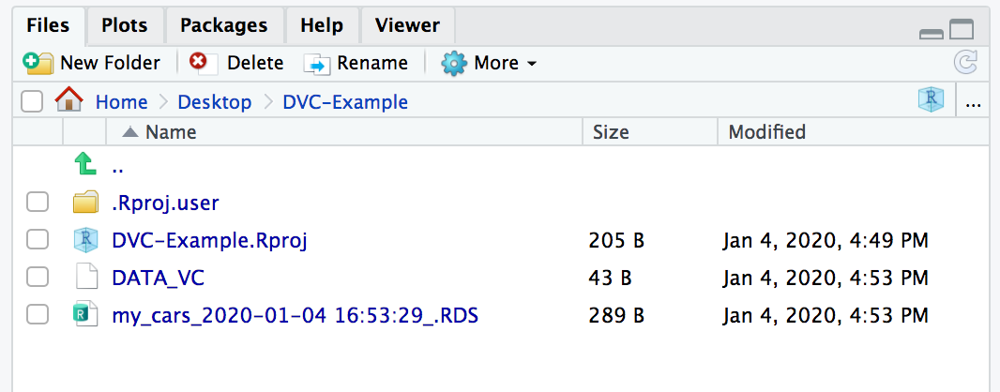
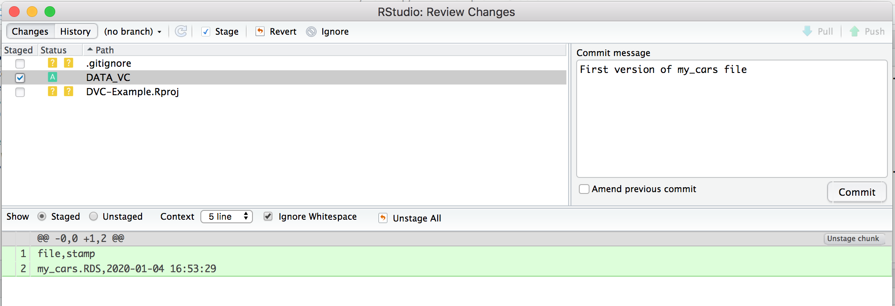
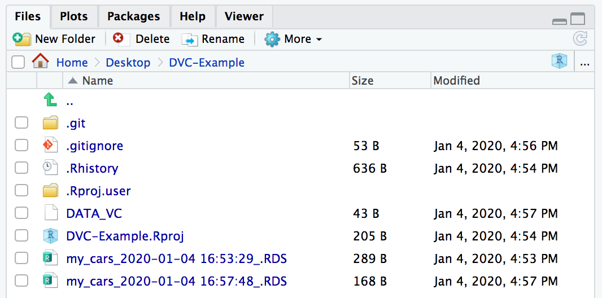
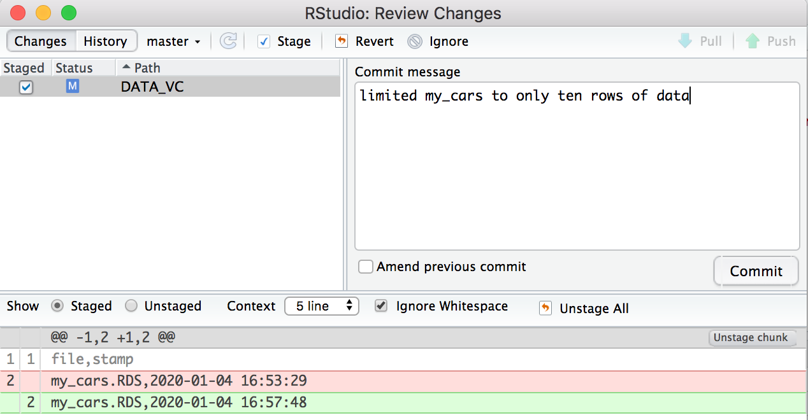

<!-- README.md is generated from README.Rmd. Please edit that file -->

```{r, include = FALSE}
knitr::opts_chunk$set(
  collapse = TRUE,
  comment = "#>",
  fig.path = "man/figures/README-",
  out.width = "100%"
)
```
# DataVersionControl

<!-- badges: start -->
<!-- badges: end -->

The goal of DataVersionControl is to make it easy to keep track of changes to clean data over the course of a project, and easily compare results before and after data cleaning scripts are changed. Because data files are not well tracked in git, this package automates the version control of data files by saving multiple versions of data files with automatic Sys.time suffixes, and a text file to track the current file to use. 

## Installation

<!-- You can install the released version of DataVersionControl from [CRAN](https://CRAN.R-project.org) with: -->

<!-- ``` r -->
<!-- install.packages("DataVersionControl") -->
<!-- ``` -->

You can install the development version of DataVersionControl from [GitHub](https://github.com/) with:

``` r
# install.packages("devtools")
devtools::install_github("williamlief/DataVersionControl")
```
## Example

This walkthrough shows you how to get up and running with DataVersionControl.  
First, in a new r project, initialize the tracking file with `make_data_vc()`
and save a test file. 
```{r setup, eval = FALSE}
devtools::install_github("williamlief/DataVersionControl")
library(DataVersionControl)
# this creates the `DATA_VC` file in your current working directory
make_data_vc()

# Here we save a file, if you look in your working directory you will see that
# it is saved with an appended stamp that shows the current system time.
saveRDS_vc(cars, "my_cars.RDS")
```



Now commit the DATA_VC file to git. If you haven't already, add *.RDS to your .gitignore
file (this will cause git to ignore RDS files, and help you maintain a clean git status)




You can read the saved data back into R.

```{r read, eval = FALSE}
# Read the file back into R without referencing the stamp
# The function checks DATA_VC to pull the current version of the file. 
read_cars <- readRDS_vc("my_cars.RDS")
```

Finally, when you have updates to your data cleaning script, you can do so without
worrying about updating file references or losing the ability to reproduce old results.

```{r update data, eval = FALSE}
# update the data set and resave it
cars_new <- cars[1:10,]

# Use the same filename to save the updated data set
saveRDS_vc(cars_new, "my_cars.RDS")
```

Note that you will now have two copies of my_cars.RDS saved, with two different time stamps. DATA_VC is updated to show the latest version of my_cars, and should now be committed to git.





You can read in the file exactly as before, and will see now that it has pulled
the updated file with only ten rows.

```{r read update, eval = FALSE}
read_cars <- readRDS_vc("my_cars.RDS")
nrow(read_cars)
```

By using saveRDS_vc and readRDS_vc throughout your project, you can ensure that you are always
pulling the current version of a data file, and that you have a complete history of data files to revert to as more data cleaning fixes are implemented. 

My preferred workflow is to have a raw-data folder that is write-once/read-only and 
contains original source data for the project, I then have a data folder that contains the
output from cleaning scripts that process the raw-data files into tidy datasets that
will be used by my analysis scripts. Often, during the course of analysis I find issues
in the data that I missed in initial cleaning and this package automates the tracking 
of the different clean versions of the data files. 

This package also works well with git branches to explore quickly how different cleaning choices impact the results. 


